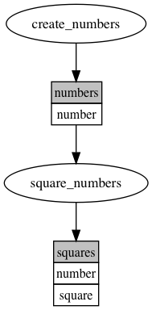

# dalymi

_[data like you mean it]_

[](http://dalymi.readthedocs.io/en/latest/?badge=latest) 

A lightweight, data-focused and non-opinionated pipeline manager written in and for Python.

--------------------------------------------------------------------------------

_dalymi_ allows to build data processing pipelines as [directed acyclic graphs]([https://en.wikipedia.org/wiki/Directed_acyclic_graph]) (DAGs) and facilitates rapid, but controlled, model development. The goal is to prototype quickly, but scale to production with ease.  
To achieve this, _dalymi_ uses "make"-style workflows, _i.e._ tasks with missing input trigger the execution of input-producing tasks before being executed themselves. At the same time, _dalymi_ provides fine control to run and undo specific pipeline parts for quick test iterations. This ensures output reproducability and minimizes manual errors.

Several features facilitate _dalymi_'s goal:

- simple, non-opinionated API (most choices left to user)
- no external dependencies for pipeline execution
- one-line installation (ready for use)
- no configuration
- auto-generated command line interface for pipeline execution
- quick start, but high flexibility to customize and extend:
    - task output can be stored in any format Python can touch (local files being the default)
    - customizable command line arguments
    - templated output location (e.g. timestamped files)
    - support for automated checks on data integrity during runtime
- DAG visualization using [graphviz](https://www.graphviz.org/)
- API design encourages good development practices (modular code, defined data schemas, self-documenting code, easy workflow viz, etc.)

In _dalymi_, DAG nodes (or "tasks") are vanilla Python functions with a specific call signature. Task dependencies (DAG edges) are defined using function decorators. These decorators specify data resources as inputs and outputs of tasks. _dalymi_ automatically builds a DAG by learning the dependencies between tasks based on their data input and output.

To learn more, check out the tutorial below, the [recipes](recipes.md), or  [examples](https://github.com/joschnitzbauer/dalymi/tree/master/examples).

Links:

- Repository: <https://github.com/joschnitzbauer/dalymi>
- Documentation: <http://dalymi.readthedocs.io>
- PyPi: <https://pypi.python.org/pypi/dalymi>

## Installation

_dalymi_ requires Python >= 3.5.

```bash
pip install dalymi
```

For the latest development:

```bash
pip install git+https://github.com/joschnitzbauer/dalymi.git
```

DAG visualization requires [graphviz](https://www.graphviz.org/).

## Tutorial

_dalymi_ programs consist of two main components: resources and tasks. Tasks are Python functions that create resources and/or require resources as input. Hence, a _dalymi_ pipeline can be described as a directed graph of tasks and resources where tasks are dependent on their input resources.

In this tutorial, we will create the following simple DAG:



!!! note
    The above image was generated by the _dalymi_ graph plot command line interface and [graphviz](https://www.graphviz.org/):
    `python examples/simple.py dot` followed by `dot -Tpng pipeline.dot -o pipeline.png`.

In this graph, ellipses and rectangles represent tasks and resources, respectively. The first row of rectangles gives the name of a resource. If the resource is a tabular dataframe (e.g. a `pandas.DataFrame`), the remaining rows indicate the expected columns in this resource.

Hence, we can see that the task `create_numbers` produces a resource called `numbers` which has a single column called `number`. The `numbers` resource in turn is being used as an input by the task `square_numbers`. Finally, `square_numbers` produces an output resource called `squares` with columns `number` and `square`.

Upon execution of a DAG, _dalymi_ attempts to run each task, but will only execute them if the respective input resources exist. If an input resource does not exist, _dalymi_ will recursively attempt to execute the producing task and revisit the unexecuted task later.

The full code to create the above pipeline is:

``` python
from dalymi import Pipeline
from dalymi.resources import PandasCSV
import pandas as pd


# Define resources:
numbers_resource = PandasCSV(name='numbers', loc='numbers.csv', columns=['number'])
squares_resource = PandasCSV(name='squares', loc='squares.csv', columns=['number', 'square'])


# Define the pipeline
pl = Pipeline()


@pl.output(numbers_resource)
def create_numbers(**context):
    return pd.DataFrame({'number': range(11)})


@pl.output(squares_resource)
@pl.input(numbers_resource)
def square_numbers(numbers, **context):
    numbers['square'] = numbers['number']**2
    return numbers


if __name__ == '__main__':
    # Run the default command line interface
    pl.cli()
```

!!! note
    Further examples can be found on [Github](https://github.com/joschnitzbauer/dalymi/tree/master/examples).

Let's go through the code bit by bit. First, the imports:

```python
from dalymi import Pipeline
from dalymi.resources import PandasCSV
import pandas as pd
```

We are using a `Pipeline` object to represent the whole workflow and instances of `PandasCSV` for Pandas dataframe resources stored as CSV files. We also import `pandas` itself for later use.

Next, we define the resources in our pipeline:

```python
numbers_resource = PandasCSV(name='numbers', loc='numbers.csv', columns=['number'])
squares_resource = PandasCSV(name='squares', loc='squares.csv', columns=['number', 'square'])
```

Here, we specify a unique name for each resource, the location where they should be stored (`loc`) and the columns we expect (`columns`).

!!! note
    Column names are not required to define dataframe resources, but it is highly encouraged for disciplined coding and self-documenting code. The integrated `dot` command can visualize the columns in each resource when specified, allowing for quick and easy documentation.

Now, we are ready to define the pipeline tasks:

```python
pl = Pipeline()


@pl.output(numbers_resource)
def create_numbers(**context):
    return pd.DataFrame({'number': range(11)})


@pl.output(squares_resource)
@pl.input(numbers_resource)
def square_numbers(numbers, **context):
    numbers['square'] = numbers['number']**2
    return numbers
```

Pipeline tasks are simple Python functions (`create_numbers` and `square_numbers`), decorated with either `Pipeline.input`, `Pipeline.output` or both.<br>
Positional arguments of the `output` decorator are matched to the returned objects of the task function. For example: in `create_numbers`, the returned dataframe is interpreted as the `numbers_resource`. The `output` decorator checks the returned objects for data integrity (in this case: "do the columns match the expected?") and stores the object at the resource location (in this case: as a flat file called `numbers.csv`).<br>
Positional arguments of the `input` decorator are loaded from the resource location and injected into a `context` dictionary with the resource name as key and the data object as value. Hence, each pipeline task must accept a `context` dictionary as keyword arguments. Adding positional arguments to an input-receiving pipeline function is a handy Python trick to extract the arguments elegantly from `context` (e.g. `numbers` is directly pulled from `context` in the definition of the `square_numbers` function).

!!! warning
    An `output` decorator **must** wrap a potential `input` decorator to ensure correct pipeline functionality.

`dalymi` provides an easy way to create command-line interfaces (CLIs) for pipelines. The default CLI is added to the above pipeline like this:

```python
if __name__ == '__main__':
    # Run the default command line interface
    pl.cli()
```

Now, we can interact with the pipeline in the following way (assuming that above code is saved in a single file `simple.py`):

```bash
python simple.py run     # executes the pipeline. skips tasks for which output already exists.
python simple.py undo    # deletes any existing output resources of the pipeline.
python simple.py dot     # creates a dot file to create pipeline diagrams with graphviz.
```

Task execution can be controlled a bit finer with CLI arguments. For example:

```bash
python simple.py run --task square_numbers    # executes only `square_numbers` (and upstream requirements if needed).
python simple.py run -t square_numbers        # short for the line above
python simple.py ls                           # lists all tasks in the pipeline
python simple.py undo --task square_numbers   # deletes only the output of `square_numbers`
python simple.py undo -t square_numbers       # short for the line above
python simple.py undo -t square_numbers -d    # deletes the output of `square_numbers` and all downstream outputs
python simple.py undo -t square_numbers --downstream    # same as above
```

CLI commands and arguments are added to the `context` dictionary, so pipeline tasks can make use of them. Given the default CLI, the minimal `context` is:

```python
{'command': '{command}'}  # where {command} is one of `run`, `undo`, `ls`, `dot`
```

Depending on optional arguments, `context` may contain other CLI entries (by the argument's long version), such as:

```python
{'task': 'square_numbers',
 'downstream': True}
```

!!! note
    Extending the CLI with custom arguments allows for easy implementation of project-specific arguments (for example the execution date). Custom arguments will be automatically added to the context, so that they are available for all pipeline functions. Moreover, resource locations can be specified as templates which are filled with context variables during runtime. This allows for argument-specific resource storage. See [Recipes](recipes.md) for further details.
